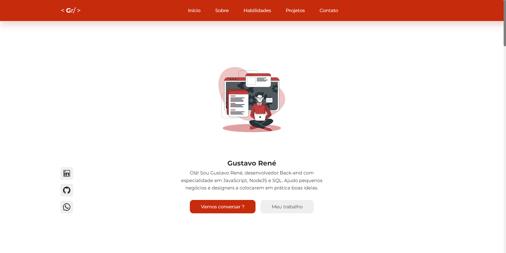

<h1 align="center">
  Portfolio
</h1>

  
  
  

 

 

## Descrição

Meu portfólio criado com o objetivo de mostrar meus projetos.

## Tecnologias

Esse projeto foi desenvolvido com as seguintes tecnologias:

- React
- JavaScript

## Bibliotecas

- [Google Fonts](https://fonts.google.com/)
- [React Icons](https://react-icons.github.io/react-icons/)

## Autor 

<table>
  <tr>
    <td align="center">
      <a href="https://github.com/gustavorenedev">
         
        
          <b>Gustavo René</b>
        
      </a>
    </td>
  </tr>
</table>

---

<h3 align="center"> Developed by <a href="https://www.linkedin.com/in/gustavo-rene-dias/">Gustavo René</a> ☕</h3>
